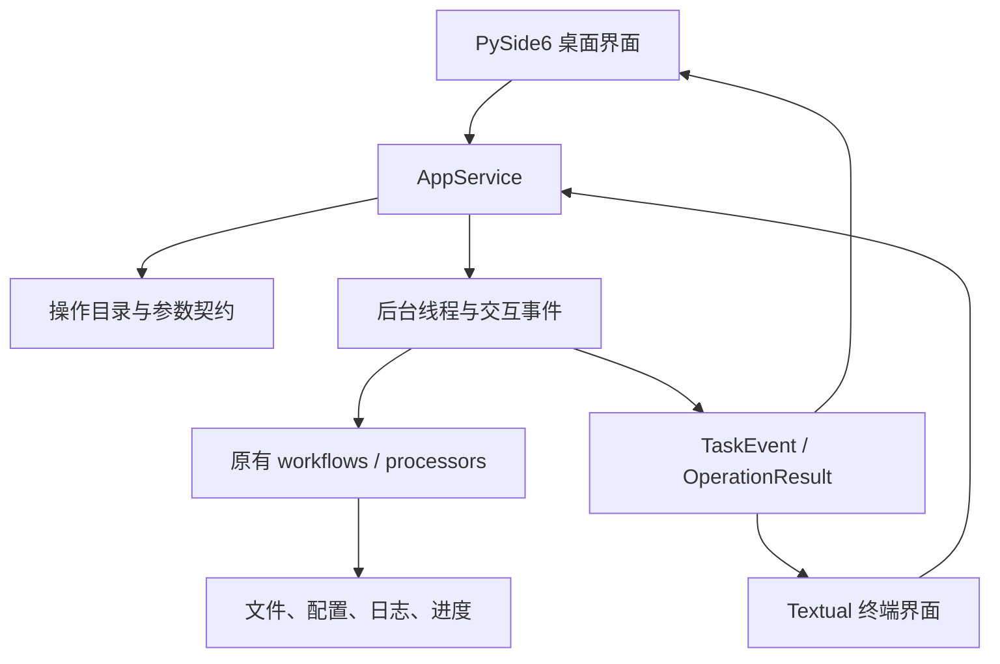

# 架构与设计依据

GUI 和 TUI 使用同一个应用服务。操作目录、参数类型、预检、确认、后台执行、进度和结果都由 `application/` 提供；界面只收集输入、展示事件和提交用户决定。现有 `processors/` 和 `workflows/` 继续负责文件处理。

## 模块与扩展方式

| 模块 | 职责 | 约束 |
| --- | --- | --- |
| `application/catalog.py`、`operations.py` | 操作列表、字段与现有功能的映射 | 两端不能各维护一套操作列表 |
| `application/handlers/` | 参数校验、预检、确认和既有处理器适配 | 不复制或重写处理算法 |
| `application/service.py` | 单任务后台执行、事件队列、交互应答 | 不从工作线程修改界面控件 |
| `application/paths.py`、`values.py` | 本机用户目录、路径解析与类型转换 | 不猜测跨系统盘符映射 |
| `contracts/`、`workflows/`、`processors/` | 原有业务与输出契约 | 原有回归测试继续执行 |
| `ui/desktop/`、`ui/tui/`、`ui/shared/` | 控件、键盘操作、表单与结果渲染 | 不导入处理器；TUI 不依赖 Qt |
| `build_exe.py`、`scripts/` | 本机原生冻结与离线分发 | 构建可联网，运行不下载依赖 |

增加已有能力的界面入口时，先在共享目录声明字段，再编写应用适配。界面根据 `ParameterSpec` 生成表单；新增类型才需要扩展两端控件。配置编辑的 `None` 表示保留原值，不能在表单中变成 `0` 或 `False`。

任务通过 `start()` 启动，界面定时调用 `poll_events()`。业务需要用户判断时发送 `InteractionRequest`，界面调用 `respond()`；应答必须匹配任务和请求 ID。退出保护保证不会遗弃正在写文件的任务。完整签名和错误约束见 [共享应用契约](../.trellis/spec/backend/application-contract.md)。

## 方案取舍与 GitHub 参考

这里的选择针对现有 Python 文件处理工具和离线要求，并不把某个框架称为所有项目的“最佳架构”。

- **桌面使用 Qt Widgets / PySide6**：保留 Python 处理代码，并使用桌面控件、系统字体和文件对话框。Qt for Python 的官方代码与示例见 [pyside/pyside-setup](https://github.com/pyside/pyside-setup)。桌面布局、配色和平台外观由 Antigravity 实现，详见 [设计规范](design/design-spec.md)。
- **终端使用 Textual**：官方仓库提供表单、树、表格和测试基础，适合将现有菜单升级为可导航界面。参考 [Textualize/textual](https://github.com/textualize/textual)。这里仅采用本地终端入口。
- **后台执行独立于界面框架**：Textual 的 [Worker 文档](https://textual.textualize.io/guide/workers/)说明耗时工作应与界面事件处理分离；Qt 的 [线程文档](https://doc.qt.io/qt-6/threads-qobject.html)要求 GUI 对象在主线程使用。本项目据此选择共享 Python 后台任务和事件队列，使两个界面使用相同流程；没有把业务执行绑定到某一端的 worker 生命周期。
- **离线分发使用 PyInstaller onedir**：参考 [pyinstaller/pyinstaller](https://github.com/pyinstaller/pyinstaller) 和官方 [多平台构建说明](https://pyinstaller.org/en/stable/usage.html#supporting-multiple-operating-systems)。Windows、macOS、Linux 分别在本机平台构建；GUI 与 TUI 分成两个产物，TUI 排除 Qt。目录形式便于携带资源和检查动态库基线。
- **图标随软件提供**：采用本地 SVG 和许可证，参考 Microsoft 的 [Fluent System Icons](https://github.com/microsoft/fluentui-system-icons)，不在启动时下载资源。

## 验证范围

源码测试、真实界面交互与冻结包验证分别记录，不能用 CI 配置代替平台运行证据。Linux 包必须在 Ubuntu 22.04 基线内构建；较新主机生成的动态库可能提高 glibc 要求。Windows/macOS 原生外观、缩放、构建和签名仍须在对应系统验收。具体结果见 [验证报告](verification-report.md)，部署方式见 [离线部署说明](offline-deployment.md)。
