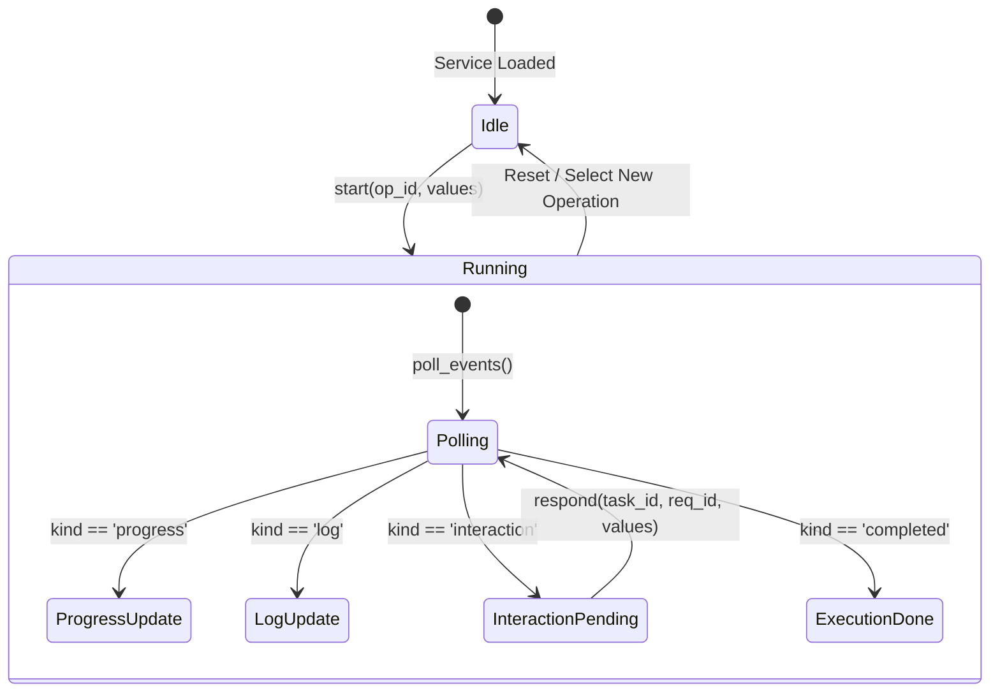

# Desktop GUI & Terminal TUI Visual and Interaction Design Specification

## 1. Overview & Principles

This document defines the unified presentation, component states, and interaction patterns for both the PySide6 Qt Widgets Desktop GUI and the Textual Terminal UI (TUI) of `integrated_script`.

### Design Tenets
1. **Restrained & Professional**: Neutral slate/blue-gray palette, crisp high-contrast surfaces, native system typography. No decorative dashboards, fake metrics, giant gradient cards, or emojis.
2. **Native Platform Harmony**: Windows 11 Fluent-inspired aesthetics on Windows (native title bar, Segoe UI, subtle rounded borders); seamless adaptation on macOS (SF Pro/PingFang) and Linux (Ubuntu/Noto Sans); Linux native dialog fallback to Qt dialogs.
3. **Dynamic Operation Rendering**: Strictly consumes `AppService.list_operations()`. No hardcoded forms or business logic assumptions.
4. **Complete Interaction & Payload Fidelity**:
   - `InteractionRequest`: Modal handling for confirmation (`{'confirmed': bool}`) and user input (`{field: value}` or `{'_cancelled': True}`).
   - `OperationResult.payload`: Displays the complete, nested result structure (trees, tables, key-values, and raw JSON) without field loss.
5. **Robust Execution State**:
   - Single active execution at a time; duplicate start rejected.
   - Non-blocking asynchronous polling via `poll_events()`.
   - Indeterminate progress when total is unknown; determinate progress when `current` and `total` are provided.
   - Window close refusal when busy; no accidental `Esc` cancellation of write operations.

---

## 2. Color System & Palettes

The UI provides three theme modes: **System**, **Light**, and **Dark**. Theme configuration is persisted independently from application business settings.

| Token | Light Theme | Dark Theme | Purpose |
|---|---|---|---|
| `bg_canvas` | `#F3F3F3` | `#202020` | Window background |
| `bg_surface` | `#FFFFFF` | `#2C2C2C` | Cards, panels, input fields |
| `bg_surface_alt` | `#F9F9F9` | `#333333` | Table headers, list hover |
| `border_subtle` | `#E5E5E5` | `#383838` | Dividers, card borders |
| `border_control` | `#D1D1D1` | `#484848` | Input/button resting border |
| `border_focus` | `#0067C0` | `#4CC2FF` | Active focus indicator (2px outline) |
| `text_primary` | `#1B1B1B` | `#F3F3F3` | Primary labels, body text |
| `text_secondary` | `#5D5D5D` | `#A0A0A0` | Descriptions, captions, hints |
| `text_disabled` | `#A6A6A6` | `#666666` | Disabled controls |
| `accent` | `#0067C0` | `#4CC2FF` | Primary action buttons, active tabs |
| `accent_hover` | `#1979C9` | `#5CD0FF` | Hover state for accent |
| `accent_pressed` | `#005FB8` | `#39AEE6` | Active/pressed state for accent |
| `status_success` | `#0F7B0F` | `#107C10` | Completed operations, valid states |
| `status_warning` | `#9D5D00` | `#FFB900` | Caution banners, non-destructive alerts |
| `status_danger` | `#C42B1C` | `#E81123` | Destructive operations, errors |
| `danger_hover` | `#A82315` | `#FF2E3F` | Destructive button hover |

---

## 3. Typography & Spacing Grid

### Font Hierarchy
Fonts are resolved dynamically via Qt `QFont` and Textual style trees with explicit Chinese fallbacks:
- **Windows**: `Segoe UI`, `Microsoft YaHei`
- **macOS**: `.AppleSystemUIFont`, `PingFang SC`
- **Linux**: `Ubuntu`, `DejaVu Sans`, `Noto Sans CJK SC`, `sans-serif`

| Level | Size | Weight | Line Height | Usage |
|---|---|---|---|---|
| **Title / Heading 1** | 18–20 pt / px | SemiBold (600) | 26 px | Window header, category header |
| **Subtitle / Heading 2** | 15–16 pt / px | Medium (500) | 22 px | Operation title, modal title |
| **Body (Default)** | 13–14 pt / px | Regular (400) | 20 px | Form labels, inputs, table cells |
| **Caption / Help** | 11–12 pt / px | Regular (400) | 16 px | Field help text, timestamps, status |
| **Code / Log** | 12–13 pt / px | Mono (400) | 18 px | Console log stream, paths, raw JSON |

### Spacing Grid
Built on a 4px/8px modular scale:
- `4px`: Control padding, icon-text gap
- `8px`: Dense item spacing, form field margin
- `12px`: Medium gaps, between related controls
- `16px`: Component padding, section separations
- `24px`: Primary panel borders, modal margins

---

## 4. Responsive Breakpoints & Sizing

### Desktop GUI
- **Standard Baseline**: `1200 x 780 px`
- **Compact Layout**: `980 x 600 px` (supports smaller displays down to 800x600 via automatic scrollbars)
- **Controls**: Minimum height of `32 px` for single-line inputs and buttons, with 4–6 px corner radius.

### Terminal UI (TUI)
- **Minimum Target**: `80 x 24 characters`
- **Layout Adaptability**:
  - `Width >= 100`: Split view (Navigation tree on left, active operation form & output on right).
  - `Width < 100`: Tabbed or collapsible drawer navigation with full-width form and scrollable result panels.

---

## 5. Dynamic Form Mapping (`ParameterSpec`)

Every parameter in `OperationSpec.fields` and `InteractionRequest.fields` maps to a typed input widget:

| `kind` | PySide6 Widget | Textual TUI Widget | Notes & Validation |
|---|---|---|---|
| `str` | `QLineEdit` | `Input` | Text input; placeholder support |
| `text` | `QPlainTextEdit` | `TextArea` | Multi-line text input |
| `path` | `PathPicker` (LineEdit + Browse) | `PathInput` (Input + AutoComplete) | Native directory/file chooser; UNC & Unicode path safe |
| `paths` | `PathsEditor` (PlainTextEdit + Add) | `PathsArea` (TextArea + helpers) | Multiple paths separated by newlines |
| `int` | `QSpinBox` | `Input(type="integer")` | Step 1, bounded range |
| `float` | `QDoubleSpinBox` | `Input(type="number")` | Step 0.05, 2-4 decimal places |
| `bool` | `QCheckBox` | `Switch` / `Checkbox` | Native boolean toggle |
| `choice`| `QComboBox` | `Select` | Dropdown populated with `(label, value)` tuples |

---

## 6. Execution, Polling & Safety Lifecycle

### Safety & Concurrency Rules
1. **Prevent Duplicate Starts**: The "Execute" button is immediately disabled upon invocation. `service.busy` check blocks concurrent attempts.
2. **Close Protection**: `closeEvent()` intercepts window close attempts while `service.busy` is true, prompting the user and prohibiting abandoning writing tasks.
3. **No Esc Force-Cancel**: The `Escape` key does NOT terminate running tasks. In modal dialogs, closing/canceling sends `{'_cancelled': True}` cleanly to the backend.
4. **Indeterminate vs. Determinate Progress**:
   - `total is None` or `total <= 0`: Indeterminate progress bar (animated marquee / pulsing).
   - `total > 0`: Determinate progress bar showing `current / total` and calculated percentage.

---

## 7. Results Presentation

When `TaskEvent.kind == 'completed'`:
1. **Status Banner**: Crisp green success banner or high-contrast red error banner with error code (e.g., `VALIDATION_ERROR`, `IO_ERROR`).
2. **Message**: Explanatory outcome text.
3. **Structured Payload Inspector**:
   - **Summary Cards**: Key counts (e.g. processed files, skipped items, duration).
   - **Data Tables**: Tabular rendering for list-of-dicts (e.g., file inventories, class distributions).
   - **Payload Tree**: Interactive hierarchical view for nested dictionaries.
   - **Raw JSON**: Formatted JSON tab with "Copy to Clipboard" for full auditability.
